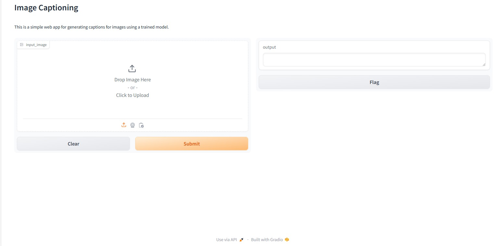
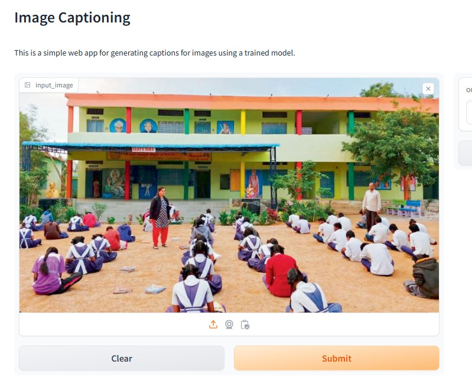

# **Image Captioning**

## Overview

This project implements a Generative AI-powered application for image captioning using the BLIP (Bootstrapping Language-Image Pre-training) model from Hugging Face's Transformers library. The application is designed to generate descriptive captions for images, leveraging state-of-the-art image-text models.
### Features
- **Image Captioning:** Automatically generate descriptive captions for images.
- **Pre-trained BLIP Model:** Utilizes BLIP, a model pre-trained on large-scale image-text pairs for accurate and coherent caption generation.
- **User-friendly Interface:** Simple interface to upload images and view generated captions.
- **Extendable:** Easily adaptable to other image-to-text tasks or different use cases.

# Installation
## Prerequisites

- Python 3.7+
- Git
- pip (Python package installer)

### Clone the Repository: 
    git clone https://github.com/OmHawaldar/ImageCaptioning
    cd image-captioning-blip
### Create a Python virtual environment
If you’re not already using a virtual environment, it’s a good idea to create one. This isolates your project dependencies and can prevent conflicts.

    pip3 install virtualenv 
    virtualenv my_env # create a virtual environment my_env
    source my_env/bin/activate # activate my_env

### Install Dependencies
    pip install langchain==0.1.11 gradio==4.21.0 transformers==4.38.2 bs4==0.0.2 requests==2.31.0 torch==2.2.1
 
 
    pip install gradio transformers Pillow

### To start the application:
    python app.py

### Generating Captions

- Upload an image through the web interface.
- The application will generate and display a caption for the uploaded image.

## Example
### This is the Interface created using gradio

### In this section an random image is given as input

### Here we can see the caption is generated as output for the given image

### Models and Training

This project uses the BLIP model from Hugging Face, which is pre-trained on large datasets of image-caption pairs. For more advanced use cases, fine-tuning the BLIP model on custom datasets is possible.
License

### Acknowledgments

- Hugging Face for the Transformers library and BLIP model.
- The open-source community for providing valuable tools and resources.
- Gradio for providing user-friendly interface for AI models 

### Contributing

Contributions are welcome! Please open an issue or submit a pull request for any improvements, bug fixes, or new features.
Contact

For any inquiries or questions, please contact [hawaldarom39@gmail.com].

For a detailed explaination of this application and it's use cases also contact [hawaldarom39@gmail.com].
